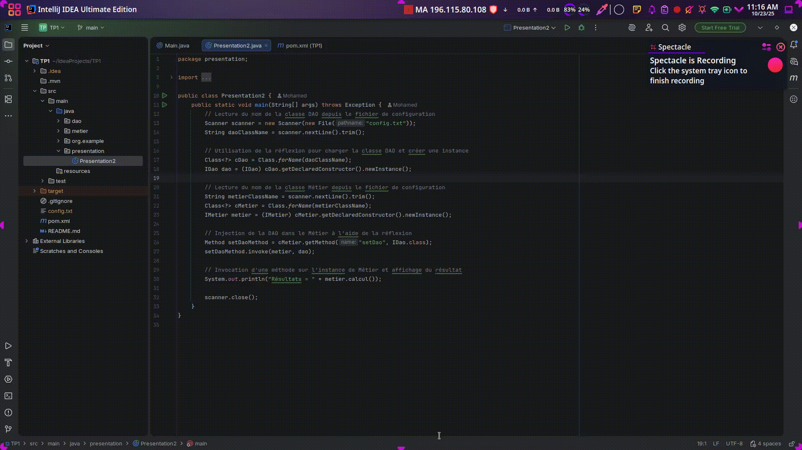

# TP1 - Programmation dynamique et réflexion en Java

Exemple simple montrant l'utilisation de la réflexion pour instancier des classes, injecter des dépendances et invoquer des méthodes en Java.

Structure:
- `src/main/java/dao` : `IDao`, `DaoImpl`
- `src/main/java/metier` : `IMetier`, `MetierImpl`
- `src/main/java/presentation` : `Presentation2` (lecture de `config.txt` et injection par réflexion)

Fichier de configuration:
- `config.txt` (à la racine) :
```
dao.DaoImpl
metier.MetierImpl
```

Exécution:

[](TP1.gif)
